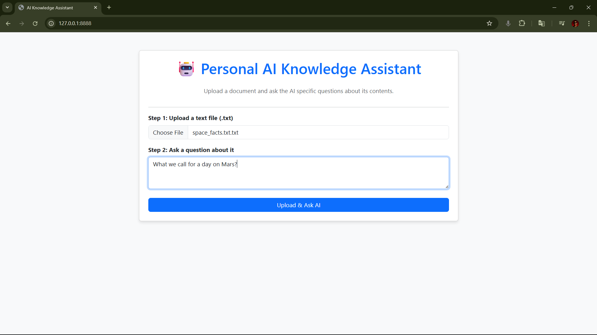
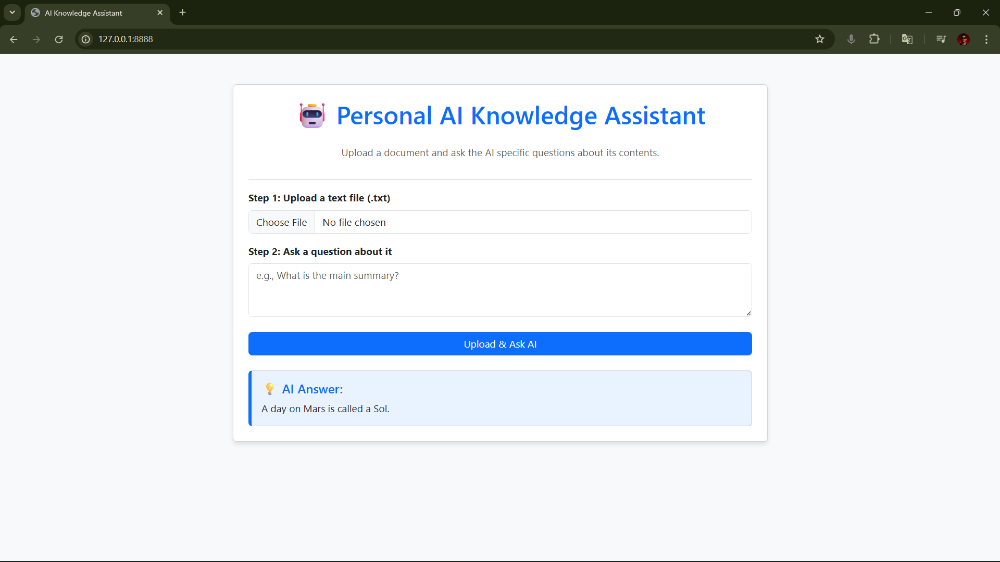

# 🤖 Personal AI Knowledge Assistant

## 🌟 Project Overview
This project is a sophisticated Retrieval-Augmented Generation (RAG) system built into a modern web application. It allows users to upload custom documents (e.g., meeting notes, research papers, legal briefs) and ask specific, context-aware questions about their content.

This project demonstrates proficiency in **Python Backend Development**, **Natural Language Processing (NLP)**, and **Web Application Engineering**.

## 🛠️ Key Technologies & Architecture
* **Core Backend:** Python 3.13.9
* **Web Framework:** Flask
* **AI/NLP:** OpenAI API (GPT-3.5) for text summarization and Q&A.
* **Vector/Embedding Model:** Used for finding the most relevant chunk of text (RAG).
* **Web Server (Production):** Gunicorn (Configured for deployment readiness).
* **Frontend:** HTML5, CSS (Bootstrap 5 for modern UI).
* **Version Control:** Git/GitHub.

## ✨ Features
* **Dynamic File Upload:** Users can upload any `.txt` file via the web interface.
* **Contextual Q&A:** The AI answers questions based *only* on the uploaded document's content.
* **Modern UX:** Clean, responsive interface built with Bootstrap.
* **Post-Redirect-Get (PRG) Pattern:** Implemented for reliable form submission and clean page refresh.

## 🚀 How to Run Locally

### Prerequisites
1.  Python 3.10+ installed.
2.  An OpenAI API Key.

### Setup Steps
1.  **Clone the Repository:**
    ```bash
    git clone https://github.com/it24104383Kalhara/Personal-AI-Knowledge-Assistant
    cd Personal-AI-Knowledge-Assistant
    ```
2.  **Create a Virtual Environment:**
    ```bash
    python -m venv my_assistant_env
    source my_assistant_env/bin/activate  # Mac/Linux
    my_assistant_env\Scripts\activate     # Windows
    ```
3.  **Install Dependencies:**
    ```bash
    pip install -r requirements.txt
    ```
4.  **Set Environment Variables:**
    Create a file named `.env` in the root directory and add your key:
    ```
    OPENAI_API_KEY="sk-YOUR_SECRET_KEY_HERE"
    ```
5.  **Run the Application:**
    ```bash
    python app.py
    ```
6.  Open your browser and navigate to **`http://127.0.0.1:8888`**

## 🖼️ Application Screenshot
Asking a question:



Giving the answer:

